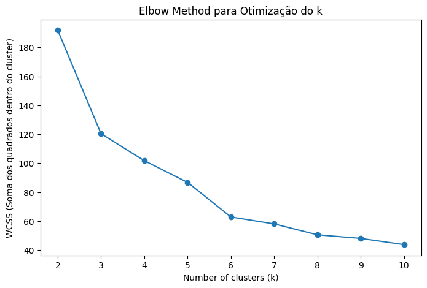
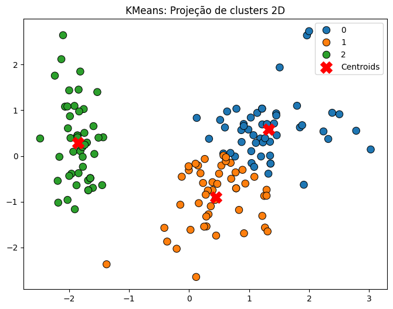
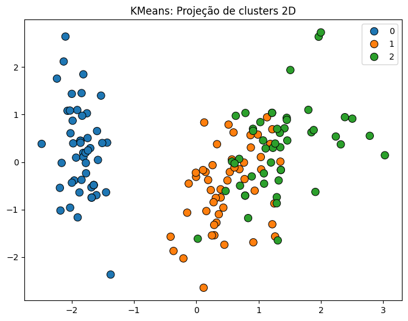

# Multi-Dataset Clustering: A K-Means Experiment

This project explores the concept of clustering in data science, focusing on the application of the K-Means clustering algorithm. Clustering is an unsupervised machine learning technique that groups data points based on their similarities, allowing us to uncover hidden patterns and structures in datasets without predefined labels.

This repository contains end-to-end analyses for two datasets (Iris and Mall Customers), applying K-Means clustering to identify spending patterns and segment groups.

## Table of Contents

1. [Background](#background)
2. [Unsupervised Learning](#unsupervised-learning)
3. [K-Means](#k-means)
4. [Tools I Used](#tools-i-used)
5. [The Process](#the-process)
6. [The Analysis](#the-analysis)
7. [What I Learned](#what-i-learned)
8. [Skills Practiced](#skills-practiced)
9. [Conclusion](#conclusion)
10. [Contact](#contact)

## Background

This project was created to practice and summarize the concepts I have learned about unsupervised learning, specifically focusing on clustering techniques. Unsupervised learning is a powerful tool for discovering hidden patterns and structures in datasets without predefined labels, and this project serves as a hands-on application of those principles.

The project contains a comprehensive analysis of two datasets: one focusing on customer spending patterns and the other on the Iris flower dataset. Through the application of K-Means clustering, I aim to demonstrate how unsupervised learning can segment data into meaningful groups. The results from both datasets will be analyzed and compared, providing insights into the effectiveness of clustering techniques in various contexts.

## Unsupervised Learning

Unsupervised learning is a type of machine learning where the computer learns from data without being told what to look for. Imagine you have a big box of mixed Lego pieces, but no instructions. You don't know exactly what you're supposed to build, but you can start sorting the pieces by color, size, or shape. This is similar to what happens in unsupervised learning.

In supervised learning, the computer is given examples with correct answers (like showing pictures of cats and dogs and labeling them). But in unsupervised learning, there are no labels or correct answers. The computer tries to find patterns, group similar things together, or detect anything unusual all by itself.

Here are two common ways unsupervised learning is used:

- **Clustering:**
This is like organizing your Lego pieces into groups. The computer looks at the data and tries to group similar items together. For example, if you give a computer a bunch of photos of animals, it might group together all the photos of animals with fur, those with feathers, and those with scales, even though it doesn't know the names of the animals.

- **Dimensionality Reduction:**
Sometimes data has too many details, and it’s hard to see the big picture. Dimensionality reduction helps by simplifying the data, keeping the important parts, and removing the unnecessary ones. It's like taking a complex recipe and simplifying it down to just the key steps.

Why is unsupervised learning useful?
It helps in situations where we don’t have labeled data or when we want the computer to discover hidden patterns we might not notice ourselves. It’s often used in things like grouping customers by their shopping habits, detecting fraud, recommending movies or products, and much more.

*In short, unsupervised learning lets computers explore and make sense of data on their own, helping us find patterns and insights without needing to guide them every step of the way!*

## K-Means

K-Means is one of the simplest and most popular methods in unsupervised learning. It’s used to group similar items into clusters. Think of it like organizing your photo gallery: the algorithm automatically groups photos that look similar, like beach photos in one group and city photos in another.

Here’s how K-Means works, step by step:

1. **Pick the Number of Clusters (K):**
First, you decide how many groups (or clusters) you want. This number is called K. For example, if you have a collection of animal photos and you want to separate them into 3 groups—say, cats, dogs, and birds—you set K = 3.

2. **Place Random Points (Centroids):**
The algorithm starts by placing K points randomly in your data. These points are called centroids, and they represent the center of each cluster. At this stage, they’re just guesses—they don’t mean anything yet.

3. **Assign Each Item to the Nearest Centroid:**
Next, the algorithm looks at each data point and checks which centroid is closest. It then assigns each data point to the nearest centroid, forming temporary clusters. Imagine drawing a line from each photo to the nearest “center” point—it’s like sorting your photos into piles based on which centroid they’re closest to.

4. **Move the Centroids:**
Now that the items are grouped, the centroids move. Each centroid shifts to the center of its assigned group. For example, if you have a cluster of dog photos, the centroid moves to the middle of that group.

5. **Repeat Until It’s Done:**
Steps 3 and 4 keep repeating:
This loop continues until the centroids don’t move much anymore. That’s when the algorithm stops.

## Tools I Used

- **Python:** The core programming language for data manipulation, analysis, and building machine learning models.
- **Pandas:** Essential for handling and analyzing structured data with ease and efficiency.
- **NumPy:** Used for numerical operations and managing multi-dimensional arrays, providing a solid foundation for data processing.
- **Matplotlib & Seaborn:** Powerful libraries for creating insightful visualizations, helping to uncover patterns and trends in the data.
- **Scikit-learn (sklearn):** A versatile machine learning library for building, training, and evaluating models.
- **Visual Studio Code:** My go-to code editor for writing, organizing, and debugging Python scripts.
- **Git & GitHub:** Crucial for version control and collaborating, ensuring my work is well-documented and accessible.

## The Process

This section outlines the key steps taken throughout the project, from organizing reusable functions to performing exploratory data analysis and clustering.

### Modularizing Functions for Reusability

At the start of this project, I focused on designing a modular structure for functions that would be reused across various experiments. This approach streamlined my workflow, reduced redundancy, and made the codebase more organized and maintainable.

To achieve this, I created separate modules for specific tasks:

- **data_preprocessing.py:** Contained functions like data_preprocess and data_scale for cleaning and scaling datasets.

- **clustering.py:** Focused on clustering techniques with functions such as clusterize, plot_elbow, evaluate_cluster, plot_clusters, pairplot, find_best_k, and plot_cluster_count.

- **utils.py:** Included utility functions like log_changes, save_dataframe, load_dataframe, plot_cluster_distribution, plot_boxplot_and_histogram, dataframe_info, and plot_correlations.

By defining an __all__ list, I explicitly specified which functions could be imported when using from module import *, ensuring clarity and control over the namespace:

```Python
__all__ = [
    "data_preprocess",
    "data_scale",
    "clusterize",
    "plot_elbow",
    "evaluate_cluster",
    "plot_clusters",
    "pairplot",
    "find_best_k",
    "plot_cluster_count",
    "log_changes",
    "save_dataframe",
    "load_dataframe",
    "plot_cluster_distribution",
    "plot_boxplot_and_histogram",
    "dataframe_info",
    "plot_correlations",
]
```
This modular design allowed me to efficiently call functions across experiments, keeping the main scripts clean and focused on the analysis rather than repetitive code.

The repository is organized with dedicated folders for notebooks, scripts, and outputs, ensuring a clean and navigable project layout.

### Exploratory Data Analysis

The exploratory analysis was conducted in the notebook [01_exploratory_analysis.ipynb](notebooks\01_exploratory_analysis.ipynb), starting with importing the dataset and using the ``dataframe_info`` function to inspect its structure. This step helped identify duplicates, missing values, and general characteristics of the data.

Next, I applied the ``plot_boxplot_and_histogram`` function to visualize the numeric features, which allowed me to detect potential outlier candidates. If a large number of outliers were apparent in the plots, they were addressed in the preprocessing phase.

The ``data_preprocess`` function was then used to:

- Remove detected outliers if necessary.

- One-hot encode string classifications.

- Fill missing values using a specified method.

- Log all preprocessing actions for traceability.

After completing these steps, I saved the preprocessed dataframe for use in subsequent analyses, ensuring a consistent and clean dataset moving forward.

### Clustering Analysis

The clustering analysis was performed in the [notebook 02_clustering_analysis.ipynb](notebooks\02_clustering_analysis.ipynb). I began by importing the preprocessed dataframe and removing static features like IDs and categorical variables such as gender, which were not relevant for clustering.

I then plotted the correlation matrix of the features using the ``plot_correlations`` function and removed any features with a correlation of 0.8 or higher to avoid redundancy. After cleaning the dataset, I applied the ``data_scale`` function to standardize the features, preparing them for clustering.

To determine the optimal number of clusters, I used the ``plot_elbow`` method to visualize the elbow plot and identified the best silhouette score with the ``find_best_k`` function. Based on these insights, I selected the appropriate number of clusters.

With the number of clusters defined, I created and trained a clustering model using the clusterize function. I then visualized the results using several techniques:

- ``pairplot`` to observe the separation between clusters.

- ``plot_cluster_count`` to display the distribution of data points across clusters.

- ``plot_cluster`` to display 2D dimensionality reduction plot to visually inspect the cluster divisions.

These analyses provided clear insights into the clustering structure of the data, leading to meaningful interpretations and conclusions.

## The Analysis

### Iris Dataset

For the first analysis, I worked with the classic Iris dataset. After preprocessing, the general structure of the dataset consisted of the following features: sepal length, sepal width, petal length, petal width, and species.

#### Exploratory Data Analysis

During the exploratory analysis, no duplicates or missing values were detected. The only necessary preprocessing step would be to encode the species feature, but as it will not be used by the model, it was not done. After completing these steps, I saved the dataframe for further analysis.

#### Preparing for Clustering

The next step involved removing the ID column and separating the species feature, as the goal of this experiment was to compare how the K-Means clustering method performs against the actual species classifications.


I analyzed feature correlations and found that petal width had a high correlation, leading to its removal from the dataset to improve clustering performance.

#### Clustering with K-Means




To determine the optimal number of clusters, I used the elbow method for verification and measured the silhouette score. Although the best silhouette score was achieved at k=2, we set k=3 to align with the known number of species in the dataset.

After creating and training the K-Means model:

1. I generated pair plots to visualize feature distributions across clusters.

| Pairplot - Cluster                           | Pairplot - Real                              |
|----------------------------------------------|----------------------------------------------|
|  |  |

2. Plotted the distribution of points in each cluster.

| Count Plot - Cluster                         | Count Plot - Real                            |
|----------------------------------------------|----------------------------------------------|
|  |  |

3. Created a 2D reduced version of the dataset to visualize the clustering.

| 2D Projection - Cluster                      | 2D Projection - Real                         |
|----------------------------------------------|----------------------------------------------|
|  |  |


I repeated these visualizations for the actual species classes, placing the images side by side for comparison. When comparing the results, it became evident that although the number of samples in each cluster was nearly accurate compared to the original classes, the clustering algorithm was only able to correctly identify one class: Iris-setosa. The Iris-versicolor and Iris-virginica classes were clearly mixed, indicating that the K-Means algorithm struggled to distinguish between these two species. Despite this, the clusters were relatively close, and the 2D reduced plot demonstrated a distribution that somewhat mirrors the real classes.

### Mall Customers Dataset

For the second analysis, I used the Mall Customers dataset. After preprocessing, the dataset's features consisted of: CustomerID, Gender, Age, Annual Income (k$), and Spending Score (1-100).

#### Exploratory Data Analysis

No duplicates or null values were found during the exploratory analysis. However, two potential outliers were identified and removed. The Gender feature was label encoded, and the preprocessed dataframe was saved for further analysis.

#### Preparing for Clustering

For the clustering analysis, I first removed the CustomerID and Gender features. While gender could have been a perfect variable for clustering into two groups, its inclusion would have oversimplified the study and limited the insights we could extract.


Next, I plotted the correlation matrix of the features. Since no features were highly correlated, I proceeded to the next steps without further adjustments. I applied the elbow method and evaluated the silhouette scores for different k values. This analysis led to selecting 6 clusters for the experiment.


#### Clustering with K-Means

After defining the number of clusters, I created and trained the K-Means model:

1. I generated pair plots to visualize the separation of features within the clusters.


2. Plotted the number of points in each cluster.


3. Created a 2D visualization to provide a simplified view of the clustering results.


The clustering results provided valuable insights into customer segments:

- **Cluster 0:** The largest group with 42 points, consisting of people of moderate age with average income and moderate spending habits.

- **Cluster 1:** Young individuals with high income and high spending, comprising 38 points.

- **Cluster 2:** Moderately aged individuals with low income and low-to-moderate spending.

- **Cluster 3:** People of all ages with high income but low spending, indicating a tendency to save.

- **Cluster 4:** Young individuals with low income but high spending behavior.

- **Cluster 5:** Young individuals with moderate income and moderate spending habits.

Insights and Recommendations

These clusters provide actionable insights for targeted marketing strategies:

- Cluster 1 and Cluster 4 represent high spenders. Tailored loyalty programs or exclusive offers could enhance engagement and profitability.

- Cluster 3, with high income but low spending, could benefit from personalized marketing strategies that highlight premium or luxury products to encourage higher expenditure.

- Cluster 2 and Cluster 0 could be targeted with budget-friendly promotions to increase spending while maintaining their loyalty.

By understanding these customer segments, businesses can develop more effective marketing strategies, optimize resource allocation, and enhance overall profitability.

## What I Learned

Through this project, I deepened my understanding of using Python and its libraries to analyze real-world datasets. Key takeaways include:

- How to manipulate and analyze data efficiently using pandas for cleaning, transforming, and exploring datasets.

- Creating compelling visualizations with matplotlib and seaborn to uncover patterns and communicate insights effectively.

- Building and evaluating machine learning models with scikit-learn, from preprocessing data to interpreting model performance.

- Gaining a solid understanding of unsupervised learning techniques, including how K-Means clustering works to group data based on inherent patterns without labeled outcomes.

- Learning how to create custom Python modules to organize experiment-specific functions, allowing me to streamline my workflow by calling these functions from separate scripts.

- The importance of structuring code and analysis in a clear, organized, and reproducible way for better readability and collaboration.

## Skills I Practiced

This project allowed me to practice and enhance the following skills:

- **Python Programming:** Applying Python for data manipulation, analysis, and automation of workflows.

- **Data Analysis with Pandas:** Cleaning, transforming, and exploring datasets to uncover insights.

- **Data Visualization:** Creating clear and informative visualizations using matplotlib and seaborn to communicate patterns and trends.

- **Machine Learning:** Implementing models with scikit-learn, focusing on unsupervised learning techniques like K-Means clustering.

- **Modular Coding:** Developing custom Python modules to streamline code organization and reusability.

- **Version Control:** Using Git and GitHub for tracking changes, collaboration, and maintaining a clear project history.

- **Problem-Solving:** Applying critical thinking to interpret results and refine analyses for meaningful conclusions.

## Conclusion

This project has been instrumental in enhancing both my technical and analytical skills. By working with real-world datasets like the Iris and Mall Customers datasets, I gained a comprehensive understanding of data preprocessing, exploratory analysis, and unsupervised learning techniques, particularly K-Means clustering.

The comparison of K-Means clustering with actual classes in the Iris dataset provided valuable insights into how clustering algorithms can approximate real-world classifications, while also highlighting their limitations. Similarly, the segmentation of mall customers uncovered distinct behavioral patterns that could drive targeted marketing strategies and business decisions.

On a professional level, this project sharpened my ability to modularize code for reusability, structure complex analyses, and derive meaningful conclusions from data. These skills are highly relevant in data science and analytics roles, where the ability to extract actionable insights from raw data is crucial. Additionally, the hands-on experience with clustering algorithms and visualization techniques has prepared me to tackle more advanced machine learning projects in the future.

Overall, this project not only deepened my technical expertise but also reinforced the importance of clear, structured analysis in solving real-world problems and driving data-driven decision-making.

## Contact

If you have any questions or feedback, feel free to reach out:\
[GitHub](https://github.com/faduzin) | [LinkedIn](https://www.linkedin.com/in/ericfadul/) | [eric.fadul@gmail.com](mailto\:eric.fadul@gmail.com)