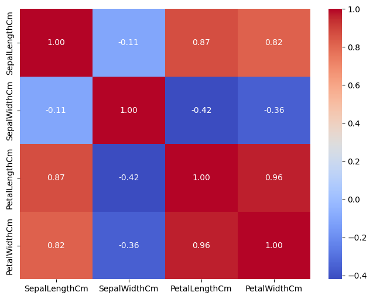
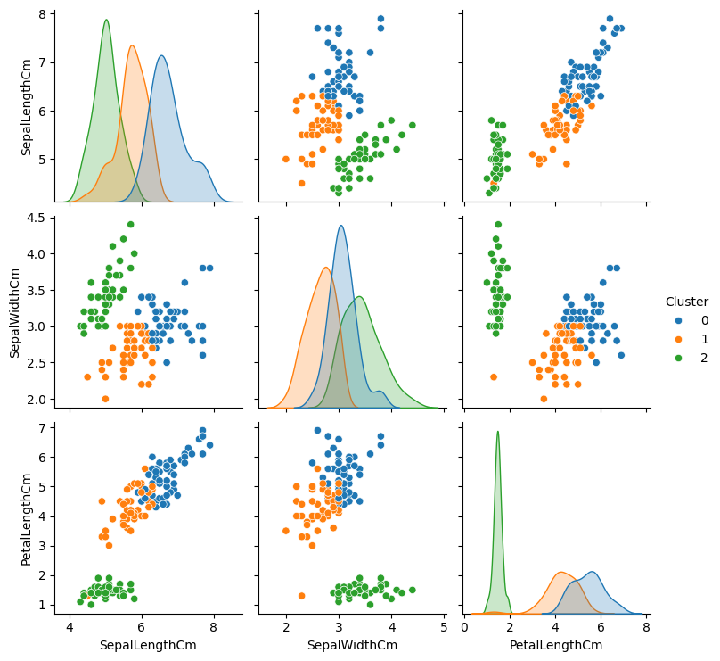
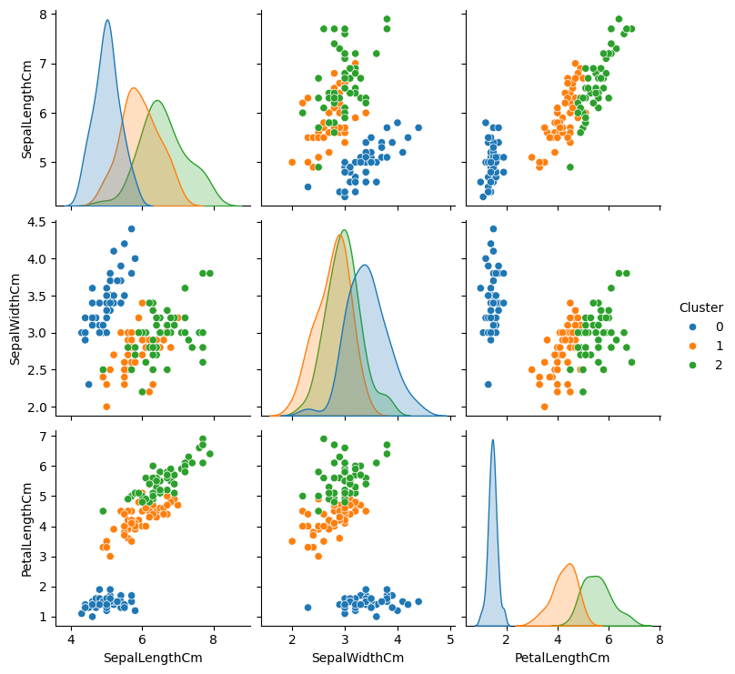
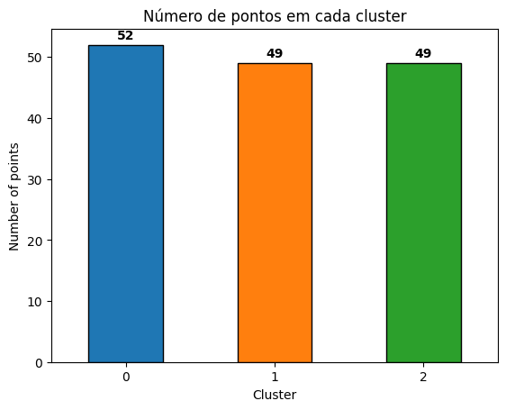
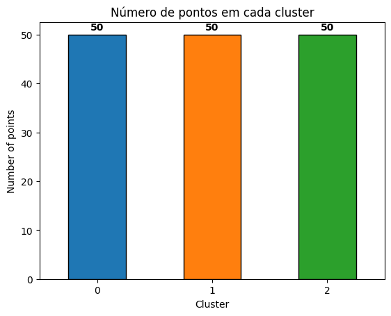

## Multi-Dataset Clustering: Um Experimento com K-Means

*To access this README in english, [click here](README.eng.md).*

Este projeto explora o conceito de **clusterização** em ciência de dados, com foco na aplicação do algoritmo de agrupamento **K-Means**. A clusterização é uma técnica de aprendizado de máquina não supervisionada que agrupa pontos de dados com base em suas semelhanças, permitindo a descoberta de padrões ocultos e estruturas em conjuntos de dados sem rótulos pré-definidos.

Este repositório contém análises completas de dois conjuntos de dados (**Iris** e **Mall Customers**), utilizando K-Means para identificar padrões de gastos e segmentar grupos.

## Índice

1. [Contexto](#contexto)  
2. [Aprendizado Não Supervisionado](#aprendizado-não-supervisionado)  
3. [K-Means](#k-means)  
4. [Ferramentas que Usei](#ferramentas-que-usei)  
5. [O Processo](#o-processo)  
6. [A Análise](#a-análise)  
7. [O que Aprendi](#o-que-aprendi)  
8. [Habilidades Praticadas](#habilidades-praticadas)  
9. [Conclusão](#conclusão)
10. [Contribuições](#contribuições)
11. [Contato](#contato)

---

## Contexto

Este projeto foi criado para praticar e resumir os conceitos que aprendi sobre aprendizado não supervisionado, com ênfase em técnicas de **clusterização**. O aprendizado não supervisionado é uma ferramenta poderosa para descobrir padrões e estruturas em conjuntos de dados sem rótulos pré-definidos, e este projeto serve como uma aplicação prática desses princípios.

O repositório contém uma análise abrangente de dois conjuntos de dados: um focado em padrões de gastos de clientes e outro no famoso conjunto de dados de flores **Iris**. Através da aplicação do K-Means, demonstro como o aprendizado não supervisionado pode segmentar dados em grupos significativos. Os resultados de ambos os conjuntos de dados são analisados e comparados, fornecendo insights sobre a eficácia de técnicas de clusterização em diferentes contextos.

---

## Aprendizado Não Supervisionado

O aprendizado não supervisionado é um tipo de **machine learning** em que o computador aprende com os dados sem saber exatamente o que procurar. Imagine que você tem uma caixa cheia de peças de Lego misturadas, mas sem instruções. Você não sabe o que deve construir, mas pode começar a separar as peças por cor, tamanho ou forma. Isso é parecido com o que acontece no aprendizado não supervisionado.

No aprendizado supervisionado, o computador recebe exemplos com respostas corretas (como mostrar fotos de gatos e cachorros com rótulos). Mas, no aprendizado não supervisionado, não existem rótulos ou respostas corretas. O computador tenta encontrar padrões, agrupar itens semelhantes ou detectar algo incomum por conta própria.

Aqui estão duas formas comuns de uso do aprendizado não supervisionado:

- **Clusterização (Clustering):**  
  É como organizar peças de Lego em grupos. O computador analisa os dados e tenta agrupar itens similares. Por exemplo, se dermos ao computador várias fotos de animais, ele pode agrupar as fotos de animais com pelos, as de animais com penas e as de animais com escamas, mesmo sem saber o nome de cada animal.

- **Redução de Dimensionalidade (Dimensionality Reduction):**  
  Às vezes, o conjunto de dados tem muitos detalhes e fica difícil enxergar o “todo”. A redução de dimensionalidade ajuda a simplificar os dados, mantendo as partes mais importantes e removendo as desnecessárias. É como pegar uma receita muito complexa e reduzi-la aos passos principais.

**Por que o aprendizado não supervisionado é útil?**  
Ele ajuda em situações em que não temos dados rotulados ou quando queremos que o computador descubra padrões ocultos que talvez não perceberíamos sozinhos. É muito usado em tarefas como agrupar clientes pelos hábitos de compra, detectar fraudes, recomendar filmes ou produtos e muito mais.

> *Em resumo, o aprendizado não supervisionado permite que computadores explorem e entendam os dados por conta própria, ajudando a encontrar padrões e insights sem precisar guiá-los a cada passo!*

---

## K-Means

O **K-Means** é um dos métodos mais simples e populares em aprendizado não supervisionado. Ele é usado para agrupar itens similares em clusters. Pense nele como organizar sua galeria de fotos: o algoritmo agrupa automaticamente fotos parecidas, como fotos de praia em um grupo e fotos de cidade em outro.

Veja como o K-Means funciona, passo a passo:

1. **Escolher o Número de Clusters (K):**  
   Primeiro, você decide quantos grupos (clusters) deseja. Esse número é chamado de K. Por exemplo, se você tem várias fotos de animais e quer separar em 3 grupos (gatos, cães e pássaros), então K = 3.

2. **Colocar Pontos Aleatórios (Centróides):**  
   O algoritmo começa colocando K pontos aleatórios nos dados. Esses pontos são chamados de centróides e representam o “centro” de cada cluster. Nesta fase, eles são apenas suposições — não significam nada ainda.

3. **Atribuir Cada Item ao Centróide Mais Próximo:**  
   Em seguida, o algoritmo olha para cada ponto de dado e verifica qual centróide está mais perto. Então, atribui cada ponto de dado ao centróide mais próximo, formando grupos temporários. É como desenhar uma linha de cada foto até o centróide mais próximo, separando suas fotos em pilhas de acordo com o centróide.

4. **Mover os Centróides:**  
   Agora que os itens foram agrupados, os centróides se movem. Cada centróide vai para o centro do seu grupo. Por exemplo, se você tem um cluster de fotos de cães, o centróide se desloca para o meio desse conjunto.

5. **Repetir até Convergir:**  
   Os passos 3 e 4 continuam:
   - Reatribuir pontos aos novos centróides.
   - Recalcular a posição dos centróides.
   Isso se repete até que os centróides não se movimentem mais significativamente. Nesse ponto, o algoritmo para.

---

## Ferramentas que Usei

- **Python:** Linguagem principal para manipulação de dados, análise e construção de modelos de machine learning.  
- **Pandas:** Essencial para lidar com dados estruturados de forma eficiente e intuitiva.  
- **NumPy:** Usado para operações numéricas e manipulação de arrays multidimensionais, fornecendo uma base sólida para processamento de dados.  
- **Matplotlib & Seaborn:** Bibliotecas poderosas para criar visualizações e ajudar a descobrir padrões e tendências nos dados.  
- **Scikit-learn (sklearn):** Biblioteca versátil de machine learning para construir, treinar e avaliar modelos.  
- **Visual Studio Code:** Meu editor de código preferido para escrever, organizar e depurar scripts em Python.  
- **Git & GitHub:** Fundamentais para controle de versão e colaboração, garantindo que o trabalho esteja bem documentado e acessível.

---

## O Processo

Esta seção descreve as etapas principais do projeto, desde a organização de funções reutilizáveis até a realização de análises exploratórias e de clusterização.

### Modularizando Funções para Reutilização

No início do projeto, foquei em projetar uma estrutura modular para as funções que seriam reutilizadas em diversos experimentos. Essa abordagem otimizou meu fluxo de trabalho, reduziu redundâncias e manteve o código mais organizado e fácil de manter.

Para isso, criei módulos separados para tarefas específicas:

- **data_preprocessing.py:**  
  Contém funções como `data_preprocess` e `data_scale` para limpeza e normalização dos conjuntos de dados.

- **clustering.py:**  
  Focado em técnicas de clusterização, com funções como `clusterize`, `plot_elbow`, `evaluate_cluster`, `plot_clusters`, `pairplot`, `find_best_k` e `plot_cluster_count`.

- **utils.py:**  
  Inclui funções utilitárias como `log_changes`, `save_dataframe`, `load_dataframe`, `plot_cluster_distribution`, `plot_boxplot_and_histogram`, `dataframe_info` e `plot_correlations`.

Ao definir uma lista `__all__`, especifiquei explicitamente quais funções poderiam ser importadas ao usar `from module import *`, garantindo clareza e controle sobre o namespace:

```python
__all__ = [
    "data_preprocess",
    "data_scale",
    "clusterize",
    "plot_elbow",
    "evaluate_cluster",
    "plot_clusters",
    "pairplot",
    "find_best_k",
    "plot_cluster_count",
    "log_changes",
    "save_dataframe",
    "load_dataframe",
    "plot_cluster_distribution",
    "plot_boxplot_and_histogram",
    "dataframe_info",
    "plot_correlations",
]
```

Esse design modular permitiu chamar funções de forma eficiente em diversos experimentos, mantendo os scripts principais limpos e focados na análise, ao invés de repetição de código.

O repositório está organizado em pastas dedicadas para notebooks, scripts e outputs, garantindo um layout de projeto limpo e fácil de navegar.

### Análise Exploratória de Dados

A análise exploratória foi realizada no notebook [01_exploratory_analysis.ipynb](notebooks\01_exploratory_analysis.ipynb), começando pela importação do conjunto de dados e uso da função `dataframe_info` para inspecionar sua estrutura. Esse passo ajudou a identificar duplicatas, valores ausentes e características gerais dos dados.

Em seguida, apliquei a função `plot_boxplot_and_histogram` para visualizar as variáveis numéricas, permitindo detectar possíveis valores outliers. Se houvesse um grande número de outliers nos gráficos, eles eram tratados na fase de pré-processamento.

A função `data_preprocess` foi então utilizada para:

- Remover outliers identificados, se necessário.  
- Realizar label encode de classificações em string.  
- Preencher valores ausentes usando o método especificado.  
- Registrar todas as ações de pré-processamento para rastreabilidade.

Depois de concluir essas etapas, salvei o DataFrame pré-processado para uso nas análises subsequentes, garantindo um conjunto de dados limpo e consistente para as próximas fases.

### Análise de Clusterização

A análise de clusterização foi executada no notebook [02_clustering_analysis.ipynb](notebooks\02_clustering_analysis.ipynb). Comecei importando o DataFrame pré-processado e removendo recursos estáticos, como IDs, além de variáveis categóricas (por exemplo, gênero) que não eram relevantes para a clusterização.

Em seguida, tracei a matriz de correlação dos recursos usando a função `plot_correlations` e removi qualquer recurso com correlação igual ou maior que 0.8 para evitar redundância. Após essa limpeza, apliquei a função `data_scale` para padronizar os recursos, preparando-os para a clusterização.

Para determinar o número ideal de clusters, usei o método do “cotovelo” (`plot_elbow`) e também medi o melhor *score* de silhueta com a função `find_best_k`. Com base nesses resultados, selecionei o número mais adequado de clusters.

Com a quantidade de clusters definida, criei e treinei o modelo de clusterização usando `clusterize`. Em seguida, visualizei os resultados através de diversas técnicas:

- `pairplot` para observar a separação dos clusters.  
- `plot_cluster_count` para exibir a distribuição de pontos de dados em cada cluster.  
- `plot_clusters` para gerar um gráfico 2D, reduzindo a dimensionalidade dos dados e inspecionar a divisão dos clusters visualmente.

Essas análises forneceram insights claros sobre a estrutura de agrupamento dos dados, resultando em interpretações e conclusões significativas.

---

## A Análise

### Conjunto de Dados Iris

Na primeira análise, utilizei o clássico conjunto de dados **Iris**. Após o pré-processamento, a estrutura geral do conjunto continha as seguintes variáveis: comprimento da sépala (sepal length), largura da sépala (sepal width), comprimento da pétala (petal length), largura da pétala (petal width) e espécie (species).

#### Análise Exploratória

Durante a análise exploratória, não foram detectadas duplicatas ou valores ausentes. O único passo de pré-processamento necessário seria codificar a variável *species*, mas como não seria usada pelo modelo, essa etapa foi dispensada. Após finalizar essas ações, salvei o DataFrame para uso posterior.

#### Preparando para a Clusterização

O próximo passo foi remover a coluna de ID e separar a variável *species*, pois o objetivo deste experimento era comparar como o método de clusterização K-Means se comporta em relação às classificações reais das espécies.



Analisei as correlações entre as variáveis e constatei que *petal width* apresentava alta correlação, optando por removê-la para melhorar o desempenho da clusterização.

#### Clusterizando com K-Means


Para determinar o número ótimo de clusters, utilizei o método do cotovelo como verificação e medi o *score* de silhueta. Embora o melhor *score* de silhueta tenha sido obtido em **k=2**, definimos **k=3** para alinhar com o número de espécies do conjunto de dados.

Depois de criar e treinar o modelo K-Means:

1. Gerei *pair plots* para visualizar a distribuição das variáveis em cada cluster.  

   | Pairplot - Cluster                           | Pairplot - Real                              |
   |----------------------------------------------|----------------------------------------------|
   |  |  |

2. Exibi a distribuição de pontos em cada cluster.  

   | Count Plot - Cluster                         | Count Plot - Real                            |
   |----------------------------------------------|----------------------------------------------|
   |  |  |

3. Criei uma versão 2D reduzida do conjunto de dados para visualizar os resultados da clusterização.  

   | 2D Projection - Cluster                      | 2D Projection - Real                         |
   |----------------------------------------------|----------------------------------------------|
   |  |  |

Também repeti essas visualizações para as classes reais das espécies, colocando as imagens lado a lado para facilitar a comparação. Ao comparar os resultados, ficou evidente que, embora o número de amostras em cada cluster fosse próximo do número de classes originais, o algoritmo de clusterização só conseguiu identificar corretamente uma classe: **Iris-setosa**. As classes **Iris-versicolor** e **Iris-virginica** ficaram claramente misturadas, indicando que o K-Means teve dificuldade em distinguir essas duas espécies. Apesar disso, os clusters ficaram relativamente próximos, e a projeção 2D mostrou uma distribuição que de certa forma lembra a disposição das classes reais.

### Conjunto de Dados Mall Customers

Na segunda análise, utilizei o conjunto de dados **Mall Customers**. Após o pré-processamento, as variáveis incluíam: *CustomerID*, *Gender*, *Age*, *Annual Income (k$)* e *Spending Score (1-100)*.

#### Análise Exploratória

Não foram encontradas duplicatas ou valores nulos. Entretanto, foram identificados dois possíveis outliers, que foram removidos. A variável *Gender* foi codificada (label encoding), e o DataFrame pré-processado foi salvo para análise posterior.

#### Preparando para a Clusterização

Para a análise de clusterização, inicialmente removi as colunas *CustomerID* e *Gender*. Embora o *Gender* pudesse gerar um agrupamento perfeito em 2 clusters, sua inclusão tornaria o estudo trivial e restringiria os insights extraídos.


Em seguida, tracei a matriz de correlação das variáveis. Como nenhuma variável apresentava correlação elevada, prossegui sem ajustes adicionais. Apliquei o método do cotovelo e avaliei os *scores* de silhueta para diferentes valores de *k*, chegando à escolha de **6 clusters** para o experimento.


#### Clusterizando com K-Means

Após definir o número de clusters, criei e treinei o modelo K-Means:

1. Gerei *pair plots* para visualizar a separação das variáveis em cada cluster.

   

2. Exibi o número de pontos em cada cluster.

   

3. Criei uma visualização 2D para ter uma visão simplificada dos resultados.

   

Os resultados da clusterização trouxeram insights valiosos sobre segmentos de clientes:

- **Cluster 0:** O maior grupo, com 42 pontos, composto por pessoas de idade moderada, renda média e hábitos de gastos moderados.
- **Cluster 1:** Indivíduos jovens, com alta renda e altos gastos, totalizando 38 pontos.
- **Cluster 2:** Pessoas de idade moderada, com baixa renda e gastos de baixo a moderado.
- **Cluster 3:** Pessoas de todas as idades, com alta renda, mas gastos baixos, sugerindo tendência a poupar.
- **Cluster 4:** Indivíduos jovens com renda baixa, mas alto nível de gastos.
- **Cluster 5:** Indivíduos jovens com renda moderada e gastos moderados.

**Insights e Recomendações**  
Esses clusters oferecem insights acionáveis para estratégias de marketing direcionadas:

- **Cluster 1** e **Cluster 4** representam alto potencial de gastos. Programas de fidelidade ou ofertas exclusivas podem aumentar o engajamento e a rentabilidade.  
- **Cluster 3**, com alta renda, mas baixos gastos, poderia se beneficiar de estratégias personalizadas que destaquem produtos premium ou de luxo para incentivar maior consumo.  
- **Cluster 2** e **Cluster 0** podem ser alvo de promoções com enfoque em economia, para aumentar o valor gasto sem perder a fidelidade.

Ao entender esses segmentos de clientes, empresas podem desenvolver estratégias de marketing mais eficazes, otimizar alocação de recursos e melhorar a lucratividade geral.

---

## O que Aprendi

Ao longo deste projeto, aprofundei meus conhecimentos em Python e suas bibliotecas para analisar conjuntos de dados reais. Os principais aprendizados incluem:

- **Manipulação de Dados com Pandas:** Limpeza, transformação e exploração de datasets.  
- **Visualização de Dados:** Criação de gráficos claros e informativos com Matplotlib e Seaborn para comunicar padrões e tendências.  
- **Construção e Avaliação de Modelos de Machine Learning:** Desde o pré-processamento até a interpretação de resultados, utilizando Scikit-learn.  
- **Aprendizado Não Supervisionado:** Compreensão sólida de como o K-Means agrupa dados com base em padrões internos, sem rótulos.  
- **Criação de Módulos Customizados em Python:** Organização de funções específicas para cada experimento, tornando o fluxo de trabalho mais ágil.  
- **Estruturação de Código e Análise Reprodutível:** Boa arquitetura de projeto, facilitando leitura e colaboração.

---

## Habilidades Praticadas

Este projeto me permitiu praticar e aprimorar as seguintes habilidades:

- **Programação em Python:** Uso de Python para manipulação de dados e automação de fluxos de trabalho.  
- **Análise de Dados com Pandas:** Limpeza, transformação e exploração de conjuntos de dados para obter insights.  
- **Visualização de Dados:** Desenvolvimento de visualizações eficazes em Matplotlib e Seaborn para apresentar descobertas.  
- **Machine Learning:** Implementação de modelos com Scikit-learn, com foco em técnicas de aprendizado não supervisionado (K-Means).  
- **Codificação Modular:** Criação de módulos em Python para otimizar a organização e a reutilização do código.  
- **Controle de Versão:** Uso de Git e GitHub para acompanhar mudanças, colaborar e manter histórico de projeto.  
- **Resolução de Problemas:** Aplicação de raciocínio crítico para interpretar resultados e refinar análises em busca de conclusões significativas.

---

## Conclusão

Este projeto foi fundamental para aprimorar minhas habilidades técnicas e analíticas. Ao trabalhar com conjuntos de dados reais, como **Iris** e **Mall Customers**, adquiri uma compreensão aprofundada sobre pré-processamento de dados, análise exploratória e técnicas de aprendizado não supervisionado, especialmente o **K-Means**.

A comparação do K-Means com as classes reais no conjunto de dados Iris evidenciou como algoritmos de clusterização podem se aproximar das classificações do mundo real, mas também revelou suas limitações. Já a segmentação de clientes em um shopping (Mall Customers) ressaltou padrões comportamentais distintos que podem guiar estratégias de marketing mais direcionadas e decisões de negócios mais assertivas.

Profissionalmente, o projeto aprimorou minha capacidade de modularizar código, estruturar análises complexas e extrair conclusões significativas a partir de dados. Essas habilidades são muito relevantes em posições de ciência de dados e análise, onde a capacidade de gerar insights acionáveis a partir de dados brutos é essencial. Além disso, a experiência prática com algoritmos de clusterização e técnicas de visualização me preparou para projetos mais avançados de machine learning no futuro.

De forma geral, este projeto não só ampliou minha expertise técnica como reforçou a importância de uma análise clara e estruturada para resolver problemas reais e fomentar decisões baseadas em dados.

---

## Contribuições

- Tayenne Euqueres
- William de Oliveira Silva
  
## Contato

Se você tiver alguma dúvida ou sugestão, sinta-se à vontade para entrar em contato:  
[GitHub](https://github.com/faduzin) | [LinkedIn](https://www.linkedin.com/in/ericfadul/) | [eric.fadul@gmail.com](mailto:eric.fadul@gmail.com)
